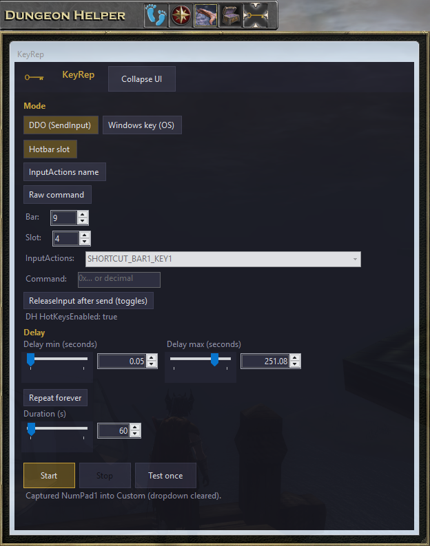
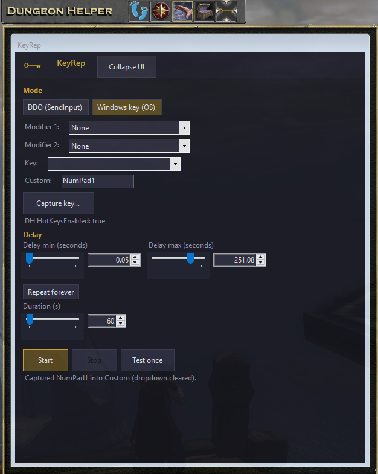

# KeyRep — getting started

KeyRep is a Dungeon Helper plugin for DDO. It repeats a hotbar command (SendInput) or a Windows key chord on a timer.

**DDO (SendInput)** — hotbar / InputActions / raw command mode.



**Windows key** — send a Windows key chord from the host OS.



## Prerequisites

- **Windows** (64-bit)
- **Dungeon Helper** installed and able to load DDO plugins
- To **compile yourself**: [.NET 8 SDK](https://dotnet.microsoft.com/download/dotnet/8.0) (Windows)

---

## Install from a release ZIP (easiest)

1. Download **`KeyRep_<version>.zip`** (for example `KeyRep_1.1.0.zip`) from the project’s releases or build artifacts.
2. Open the **Dungeon Helper** loader.
3. Open **Settings**.
4. In the **Misc** section, choose **Add Plugin (zip file)** and select the ZIP you downloaded.
5. In the same **Misc** section, use **Restart Dungeon Helper** so the loader picks up the new plugin.

---

## Build from source

1. Install the **.NET 8 SDK** and confirm in a terminal:

   ```powershell
   dotnet --version
   ```

   You should see a `8.x.x` SDK.

2. Open a terminal in the **KeyRep** folder (the one that contains `pack.ps1` and `src`).

3. **Quick compile only** (output under `src\KeyRep\bin\`):

   ```powershell
   dotnet build .\src\KeyRep\KeyRep.csproj -c Release -p:Platform=x64
   ```

4. **Full package** (publish, trim staged files, write the plugin ZIP, and copy into your Dungeon Helper plugins folder):

   ```powershell
   .\pack.ps1
   ```

   This creates **`dist\KeyRep_<version>.zip`** (the version in the filename comes from `pack.ps1`, default `1.1.0`) and mirrors the same files to `%APPDATA%\Dungeon Helper\plugins\KeyRep`. Close Dungeon Helper before running `pack.ps1` if files are in use.

5. To install what you built, use **Install from a release ZIP** with `dist\KeyRep_<version>.zip`, or rely on the copy step if you already restarted Dungeon Helper after packing.

You can override the zip name version with:

```powershell
.\pack.ps1 -Version "1.2.0"
```

---

## Troubleshooting

- **Plugin does not show up:** After **Add Plugin (zip file)**, use **Restart Dungeon Helper** in **Settings → Misc**.
- **Build errors:** Use **Release** and **x64**: `-c Release -p:Platform=x64` (matches the project).
- **`pack.ps1` copy fails:** Exit Dungeon Helper so nothing locks files under `%APPDATA%\Dungeon Helper\plugins\KeyRep`.
